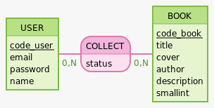

# 📚 Blablabook


**Blablabook** est une application web de gestion de bibliothèque personnelle et sociale : [DÉCRIRE EN 1-2 PHRASES : à qui elle s'adresse et le problème qu'elle résout. Ex. « Les lecteurs peuvent cataloguer leurs livres, suivre leurs lectures et partager leurs avis. »]

**Démo en ligne : [blablabook-tp.vercel.app](https://blablabook-tp.vercel.app)**

> Projet réalisé dans le cadre de la formation DWWM chez O'Clock, en équipe de 4 personnes.

## Fonctionnalités

- Inscription et connexion sécurisées
- Gestion de la bibliothèque (ajout, modification, suppression de livres)
- Recherche et filtrage des livres

---

## 🛠️ Stack technique

| Couche              | Technologies                         |
| ------------------- | ------------------------------------ |
| **Frontend**        | Svelte, Vite                         |
| **Backend**         | Node.js, [Express / autre], API REST |
| **Base de données** | PostgreSQL                           |
| **Infrastructure**  | Docker, Docker Compose               |
| **Déploiement**     | Vercel                               |

---

## 🏗️ Architecture

```
Blablabook-TP/
├── api/                 # API REST (Node.js / PostgreSQL)
├── client/              # Interface utilisateur (Svelte / Vite)
├── docs/                # Conception : design, MCD/MLD, wireframes, user stories
├── .docker.env.exemple  # Modèle des variables d'environnement
└── docker-compose.yml   # Orchestration des services
```

| Service             | Conteneur             | Port   | Image / Runtime                 |
| ------------------- | --------------------- | ------ | ------------------------------- |
| **API**             | `blablabook-api`      | `3000` | Node.js 24-alpine               |
| **Client**          | `blablabook-client`   | `4173` | Node.js 24-alpine (Svelte/Vite) |
| **Base de données** | `blablabook-database` | `5432` | PostgreSQL 18-alpine            |

### Modèle de données



---

## 🚀 Installation

### Prérequis

- [Docker](https://docs.docker.com/get-docker/) et Docker Compose
- _(Sans Docker)_ Node.js 24+ et PostgreSQL 18+

### Avec Docker (recommandé)

1. **Cloner le dépôt**

   ```bash
   git clone https://github.com/Alexl3004/Blablabook-TP.git
   cd Blablabook-TP
   ```

2. **Configurer l'environnement** : copier le modèle puis renseigner les valeurs

   ```bash
   cp .docker.env.exemple .docker.env
   ```

3. **Lancer les services**

   ```bash
   docker compose up -d
   ```

4. **Accéder à l'application**
   - Client : <http://localhost:4173>
   - API : <http://localhost:3000>

Pour arrêter les services : `docker compose down`

### Sans Docker

```bash
# API
cd api
npm install
npm run dev

# Client (dans un autre terminal)
cd client
npm install
npm run dev
```

### Variables d'environnement

| Variable            | Description             | Exemple      |
| ------------------- | ----------------------- | ------------ |
| `POSTGRES_USER`     | Utilisateur de la base  | `blablabook` |
| `POSTGRES_PASSWORD` | Mot de passe de la base | `changeme`   |
| `POSTGRES_DB`       | Nom de la base          | `blablabook` |

---

## 📡 API

La liste complète des routes est disponible ici : [Liste des routes](docs/Modelisation/Liste%20des%20routes.md).

| Méthode | Route                | Description       | Auth |
| ------- | -------------------- | ----------------- | ---- |
| `POST`  | `/api/auth/register` | Créer un compte   | ❌   |
| `POST`  | `/api/auth/login`    | Se connecter      | ❌   |
| `GET`   | `/api/books`         | Lister les livres | ✅   |
| `POST`  | `/api/books`         | Ajouter un livre  | ✅   |

> Remplace ces exemples par les routes principales de ton projet.

---

## 📂 Documentation

Toute la phase de conception est dans le dossier [`docs/`](./docs) :

| Thème               | Contenu                                                                                                                                                                                                 |
| ------------------- | ------------------------------------------------------------------------------------------------------------------------------------------------------------------------------------------------------- |
| **Projet**          | [Présentation du projet](docs/Modelisation/Présentation%20du%20projet.md), [User stories](docs/Modelisation/User_stories.md), [Liste des technologies](docs/Modelisation/Liste%20des%20technologies.md) |
| **Base de données** | [MCD](docs/MCD/mcd.md), [MLD](docs/MLD/MLD.md), [script SQL](docs/MLD/mld.sql), [dictionnaire de données](docs/Modelisation/dictionnaire%20de%20données.md)                                             |
| **API**             | [Liste des routes](docs/Modelisation/Liste%20des%20routes.md)                                                                                                                                           |
| **Design**          | [Charte graphique](docs/Design/charte.md)                                                                                                                                                               |
| **Wireframes**      | [`docs/wireframe/`](docs/wireframe) : accueil, collection, détail d'un livre, inscription/connexion, liste des livres, profil (fichiers `.drawio`)                                                      |
